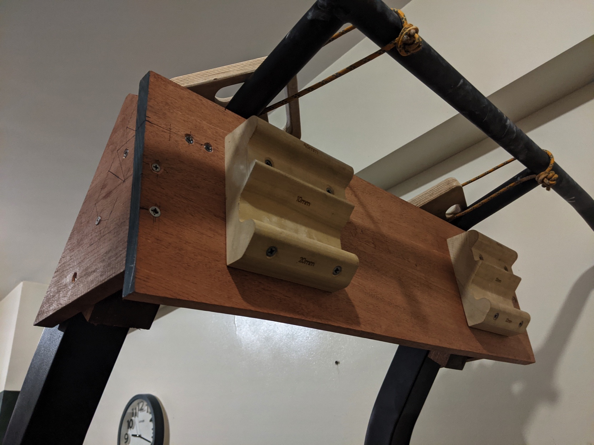
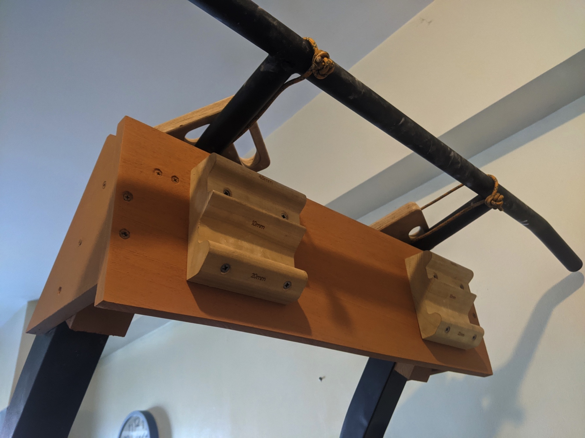
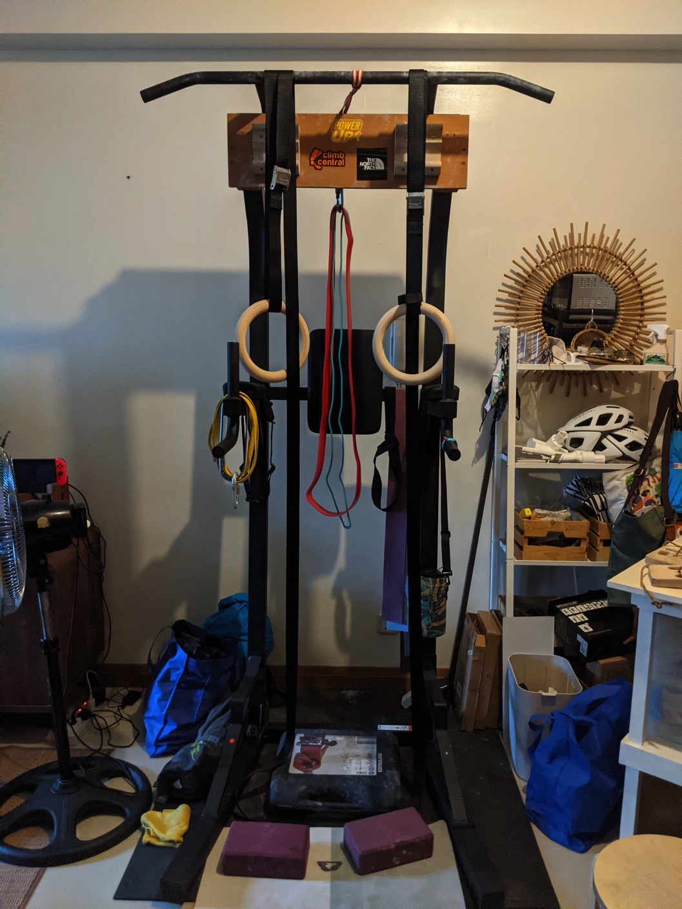

First project that got me started in this hobby. I attached [Lattice Triple Twins](https://latticetraining.com/product/lattice-triple-twins/) on a board and devised a way to bolt it to my pull-up station. It works suprisingly great and I've been using it ever since I built it.

  <figure><figcaption>Before painting</figcaption></figure>
  <figure><figcaption>After painting</figcaption></figure>

<figure><figcaption>Pandemic home gym</figcaption></figure>
