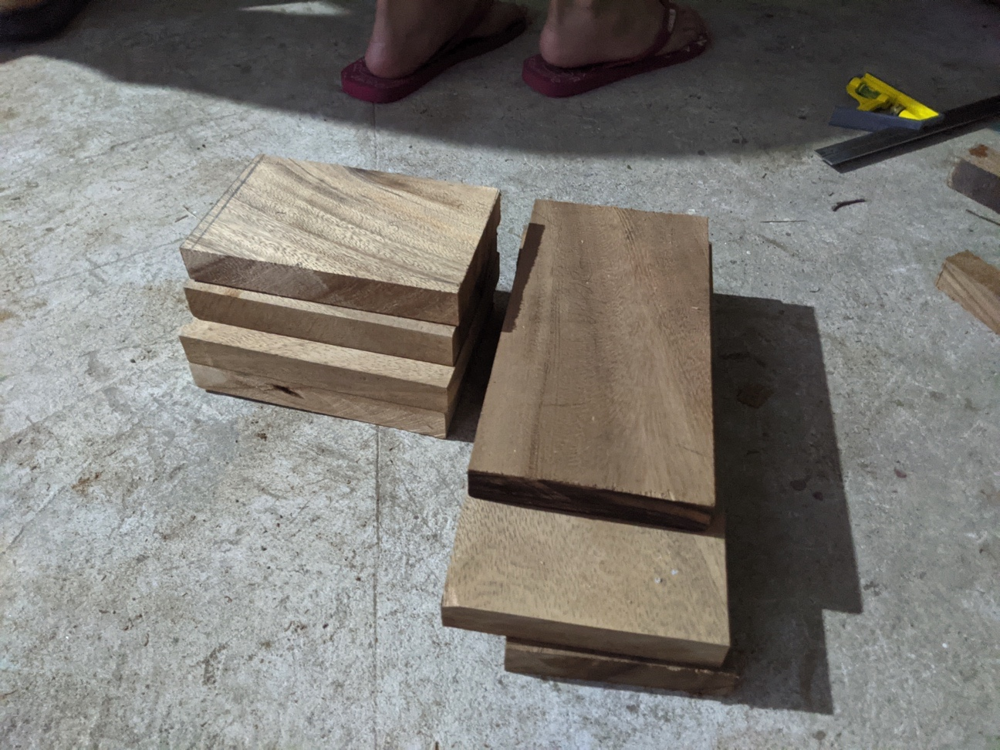
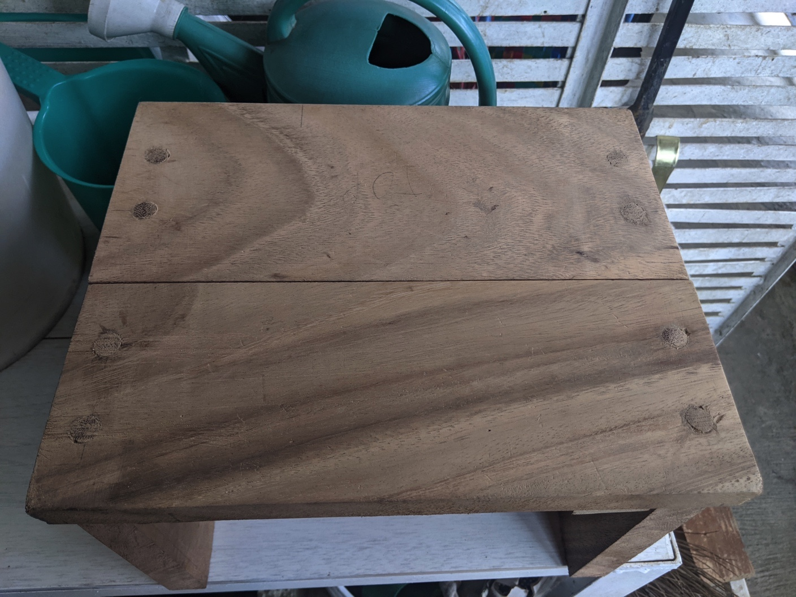
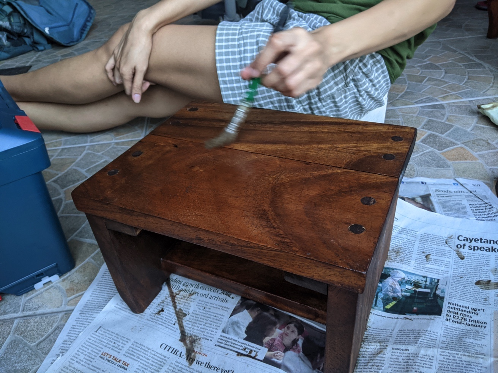

I told a friend about this new hobby I'm trying to learn and she asked if I could build her a I kitchen stool. There were some wood scraps lying around my then about-to-be-father-in-law's shed and thought they'd be enough for the build. They were just enough and I had to do some glue-ups which wasn't that successful because my cuts weren't the best then. It was a wobbly stool. The legs were also not balanced initially and I used that as an excuse to get a block plane. We finished it with some stain left over from a friend's project. She liked it but didn't really get to use it as stool because it wasn't stable so it instead became a stand for one of her artworks.

<figure><figcaption>The aforementioned scraps</figcaption></figure>
<figure><figcaption>Me realizing that end grain planing is stupid</figcaption></figure>
<figure><figcaption>Dowel plugs that took me too long to make</figcaption></figure>
<figure><figcaption>At least the finish looked good</figcaption></figure>
<figure><figcaption>Doing what it's supposed to do</figcaption></figure>